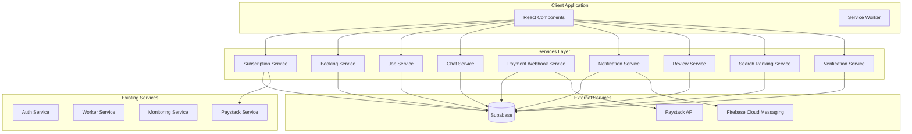

# Design Document: BlueCollar Marketplace Backend Services

## Overview

This design document outlines the architecture and implementation approach for the backend services of the BlueCollar marketplace platform serving Ghana and Nigeria. The platform enables blue-collar workers to subscribe to visibility tiers and allows customers to post jobs and book workers.

The services include:
1. **Subscription & Billing Service** - Manage worker subscription tiers with local pricing
2. **Booking Service** - Handle the complete booking lifecycle
3. **Job Service** - Customer job postings and search
4. **Chat/Messaging Service** - In-app messaging between users
5. **Payment Webhook Service** - Secure Paystack webhook verification
6. **Notification Service** - Push and in-app notifications
7. **Ratings & Reviews Service** - Post-booking reviews and ratings
8. **Search Ranking Enhancement** - Composite scoring for worker search
9. **Verification Service** - Worker KYC document management

## Architecture



### Data Flow

1. **Subscription Flow**: Worker selects tier → Payment via Paystack → Webhook verification → Subscription created → Worker visibility updated
2. **Booking Flow**: Customer creates booking → Worker accepts → Work starts → Work completes → Review submitted
3. **Job Flow**: Customer posts job → Workers search/view → Booking created → Job status updated
4. **Chat Flow**: User initiates conversation → Messages exchanged → Read receipts updated
5. **Notification Flow**: Event triggers → In-app notification stored → Push sent via FCM

## Components and Interfaces

### 1. Subscription Service

```typescript
// services/subscriptionService.ts
interface SubscriptionPlan {
  id: string;
  tier: WorkerTier;
  name: string;
  price: number;
  currency: Currency;
  features: string[];
}

interface SubscriptionService {
  getSubscriptionPlans(country: Country): Promise<SubscriptionPlan[]>;
  createSubscription(userId: string, planId: string, paymentMethod: string): Promise<ServiceResult<Subscription>>;
  getActiveSubscription(userId: string): Promise<ServiceResult<Subscription | null>>;
  cancelSubscription(subscriptionId: string): Promise<ServiceResult<Subscription>>;
  checkSubscriptionStatus(userId: string): Promise<'active' | 'expiring' | 'expired' | 'none'>;
  handleSubscriptionExpiry(): Promise<ServiceResult<number>>;
}
```

### 2. Booking Service

```typescript
// services/bookingService.ts
type BookingStatus = 'PENDING' | 'ACCEPTED' | 'IN_PROGRESS' | 'COMPLETED' | 'REVIEWED' | 'CANCELLED';

interface BookingService {
  createBooking(jobId: string, workerId: string, customerMessage?: string): Promise<ServiceResult<Booking>>;
  acceptBooking(bookingId: string, workerMessage?: string): Promise<ServiceResult<Booking>>;
  startBooking(bookingId: string): Promise<ServiceResult<Booking>>;
  completeBooking(bookingId: string): Promise<ServiceResult<Booking>>;
  cancelBooking(bookingId: string, reason: string): Promise<ServiceResult<Booking>>;
  getBookingsByWorker(workerId: string, status?: BookingStatus): Promise<ServiceResult<Booking[]>>;
  getBookingsByCustomer(customerId: string, status?: BookingStatus): Promise<ServiceResult<Booking[]>>;
  getBookingDetails(bookingId: string): Promise<ServiceResult<BookingDetails>>;
}
```

### 3. Job Service

```typescript
// services/jobService.ts
type JobStatus = 'open' | 'filled' | 'cancelled';

interface JobSearchFilters {
  category?: string;
  location?: string;
  country?: Country;
  budgetMin?: number;
  budgetMax?: number;
  status?: JobStatus;
}

interface JobService {
  createJob(posterId: string, jobData: JobInput): Promise<ServiceResult<Job>>;
  updateJob(jobId: string, updates: Partial<JobInput>): Promise<ServiceResult<Job>>;
  deleteJob(jobId: string): Promise<ServiceResult<void>>;
  getJob(jobId: string): Promise<ServiceResult<Job>>;
  searchJobs(filters: JobSearchFilters): Promise<ServiceResult<Job[]>>;
  getJobsByPoster(userId: string): Promise<ServiceResult<Job[]>>;
}
```

### 4. Chat Service

```typescript
// services/chatService.ts
interface ChatService {
  createConversation(user1Id: string, user2Id: string, bookingId?: string): Promise<ServiceResult<Conversation>>;
  sendMessage(conversationId: string, senderId: string, body: string, attachments?: string[]): Promise<ServiceResult<Message>>;
  getConversations(userId: string): Promise<ServiceResult<Conversation[]>>;
  getMessages(conversationId: string, limit?: number, cursor?: string): Promise<ServiceResult<PaginatedMessages>>;
  markAsRead(conversationId: string, userId: string): Promise<ServiceResult<void>>;
  getUnreadCount(userId: string): Promise<ServiceResult<number>>;
}
```

### 5. Payment Webhook Service

```typescript
// services/paymentWebhookService.ts
interface PaymentWebhookService {
  verifyPaystackSignature(payload: string, signature: string): boolean;
  handlePaystackWebhook(event: PaystackWebhookEvent): Promise<ServiceResult<void>>;
  handleSubscriptionPayment(reference: string, status: PaymentStatus): Promise<ServiceResult<void>>;
  handleBookingPayment(reference: string, status: PaymentStatus): Promise<ServiceResult<void>>;
  logTransaction(userId: string, type: TransactionType, amount: number, currency: Currency, provider: string, status: string): Promise<ServiceResult<Transaction>>;
}
```

### 6. Notification Service

```typescript
// services/notificationService.ts
type NotificationType = 'new_message' | 'booking_request' | 'booking_accepted' | 'booking_completed' | 
  'subscription_expiring' | 'subscription_expired' | 'payment_failed' | 'new_review';

interface NotificationService {
  sendPushNotification(userId: string, title: string, body: string, data?: Record<string, string>): Promise<ServiceResult<void>>;
  createInAppNotification(userId: string, type: NotificationType, title: string, body: string, metadata?: Record<string, any>): Promise<ServiceResult<Notification>>;
  getNotifications(userId: string, unreadOnly?: boolean): Promise<ServiceResult<Notification[]>>;
  markNotificationRead(notificationId: string): Promise<ServiceResult<void>>;
  registerDeviceToken(userId: string, token: string, platform: 'ios' | 'android' | 'web'): Promise<ServiceResult<void>>;
}
```

### 7. Review Service

```typescript
// services/reviewService.ts
interface ReviewService {
  createReview(bookingId: string, raterId: string, ratedId: string, score: number, text?: string): Promise<ServiceResult<Review>>;
  getReviewsForWorker(workerId: string, limit?: number, cursor?: string): Promise<ServiceResult<PaginatedReviews>>;
  getReviewsByUser(userId: string): Promise<ServiceResult<Review[]>>;
  canReview(bookingId: string, userId: string): Promise<ServiceResult<boolean>>;
  updateWorkerRating(workerId: string): Promise<ServiceResult<void>>;
}
```

### 8. Search Ranking Service (Enhancement to Worker Service)

```typescript
// services/workerService.ts (enhanced)
interface RankingFactors {
  tierWeight: number;      // Premium: 1.0, Basic: 0.6, Free: 0.3
  ratingScore: number;     // Normalized 0-1
  distanceScore: number;   // Inverse distance, 0-1
  activityBonus: number;   // 0.1 if logged in past 7 days
  completionRate: number;  // completed/accepted, 0-1
  responseTime: number;    // Normalized inverse response time, 0-1
}

interface WorkerServiceEnhanced extends WorkerService {
  searchWorkersRanked(filters: WorkerSearchFilters, userLocation?: { lat: number; lng: number }): Promise<ServiceResult<RankedWorker[]>>;
  calculateCompositeScore(worker: WorkerProfile, factors: RankingFactors): number;
}
```

### 9. Verification Service

```typescript
// services/verificationService.ts
type DocumentType = 'government_id' | 'skill_certificate' | 'selfie';
type VerificationStatus = 'pending' | 'approved' | 'rejected';

interface VerificationService {
  uploadVerificationDocument(userId: string, docType: DocumentType, fileUrl: string): Promise<ServiceResult<VerificationDocument>>;
  getVerificationStatus(userId: string): Promise<ServiceResult<VerificationState>>;
  submitForVerification(userId: string): Promise<ServiceResult<void>>;
  approveVerification(userId: string, adminId: string): Promise<ServiceResult<void>>;
  rejectVerification(userId: string, adminId: string, reason: string): Promise<ServiceResult<void>>;
}
```

## Data Models

### Database Schema

```sql
-- Subscriptions table
CREATE TABLE public.subscriptions (
  id UUID PRIMARY KEY DEFAULT gen_random_uuid(),
  user_id UUID REFERENCES public.profiles(id) NOT NULL,
  tier TEXT NOT NULL CHECK (tier IN ('free', 'basic', 'premium')),
  currency TEXT NOT NULL CHECK (currency IN ('GHS', 'NGN')),
  amount NUMERIC NOT NULL,
  status TEXT NOT NULL CHECK (status IN ('active', 'cancelled', 'expired')),
  payment_provider TEXT,
  provider_subscription_id TEXT,
  started_at TIMESTAMPTZ NOT NULL DEFAULT NOW(),
  expires_at TIMESTAMPTZ NOT NULL,
  auto_renew BOOLEAN DEFAULT TRUE,
  created_at TIMESTAMPTZ DEFAULT NOW(),
  updated_at TIMESTAMPTZ DEFAULT NOW()
);

-- Jobs table
CREATE TABLE public.jobs (
  id UUID PRIMARY KEY DEFAULT gen_random_uuid(),
  poster_user_id UUID REFERENCES public.profiles(id) NOT NULL,
  title TEXT NOT NULL,
  description TEXT,
  category TEXT NOT NULL,
  location TEXT NOT NULL,
  location_lat NUMERIC,
  location_lng NUMERIC,
  country TEXT NOT NULL CHECK (country IN ('GH', 'NG')),
  budget_min NUMERIC,
  budget_max NUMERIC,
  currency TEXT CHECK (currency IN ('GHS', 'NGN')),
  status TEXT NOT NULL DEFAULT 'open' CHECK (status IN ('open', 'filled', 'cancelled')),
  scheduled_at TIMESTAMPTZ,
  created_at TIMESTAMPTZ DEFAULT NOW(),
  updated_at TIMESTAMPTZ DEFAULT NOW()
);

-- Bookings table
CREATE TABLE public.bookings (
  id UUID PRIMARY KEY DEFAULT gen_random_uuid(),
  job_id UUID REFERENCES public.jobs(id) NOT NULL,
  worker_user_id UUID REFERENCES public.profiles(id) NOT NULL,
  customer_user_id UUID REFERENCES public.profiles(id) NOT NULL,
  status TEXT NOT NULL DEFAULT 'PENDING' CHECK (status IN ('PENDING', 'ACCEPTED', 'IN_PROGRESS', 'COMPLETED', 'REVIEWED', 'CANCELLED')),
  customer_message TEXT,
  worker_message TEXT,
  scheduled_at TIMESTAMPTZ,
  started_at TIMESTAMPTZ,
  completed_at TIMESTAMPTZ,
  cancelled_at TIMESTAMPTZ,
  cancellation_reason TEXT,
  created_at TIMESTAMPTZ DEFAULT NOW(),
  updated_at TIMESTAMPTZ DEFAULT NOW()
);

-- Conversations table
CREATE TABLE public.conversations (
  id UUID PRIMARY KEY DEFAULT gen_random_uuid(),
  participant_1 UUID REFERENCES public.profiles(id) NOT NULL,
  participant_2 UUID REFERENCES public.profiles(id) NOT NULL,
  booking_id UUID REFERENCES public.bookings(id),
  last_message_at TIMESTAMPTZ,
  created_at TIMESTAMPTZ DEFAULT NOW()
);

-- Messages table
CREATE TABLE public.messages (
  id UUID PRIMARY KEY DEFAULT gen_random_uuid(),
  conversation_id UUID REFERENCES public.conversations(id) NOT NULL,
  sender_id UUID REFERENCES public.profiles(id) NOT NULL,
  body TEXT NOT NULL,
  attachments TEXT[],
  read_at TIMESTAMPTZ,
  created_at TIMESTAMPTZ DEFAULT NOW()
);

-- Transactions table
CREATE TABLE public.transactions (
  id UUID PRIMARY KEY DEFAULT gen_random_uuid(),
  user_id UUID REFERENCES public.profiles(id) NOT NULL,
  type TEXT NOT NULL CHECK (type IN ('subscription', 'booking', 'refund')),
  amount NUMERIC NOT NULL,
  currency TEXT NOT NULL CHECK (currency IN ('GHS', 'NGN')),
  payment_provider TEXT NOT NULL,
  provider_txn_id TEXT,
  status TEXT NOT NULL,
  metadata JSONB,
  created_at TIMESTAMPTZ DEFAULT NOW()
);

-- Notifications table
CREATE TABLE public.notifications (
  id UUID PRIMARY KEY DEFAULT gen_random_uuid(),
  user_id UUID REFERENCES public.profiles(id) NOT NULL,
  type TEXT NOT NULL,
  title TEXT NOT NULL,
  body TEXT NOT NULL,
  metadata JSONB,
  read_at TIMESTAMPTZ,
  created_at TIMESTAMPTZ DEFAULT NOW()
);

-- Device tokens table
CREATE TABLE public.device_tokens (
  id UUID PRIMARY KEY DEFAULT gen_random_uuid(),
  user_id UUID REFERENCES public.profiles(id) NOT NULL,
  token TEXT NOT NULL UNIQUE,
  platform TEXT NOT NULL CHECK (platform IN ('ios', 'android', 'web')),
  created_at TIMESTAMPTZ DEFAULT NOW()
);

-- Verification documents table
CREATE TABLE public.verification_documents (
  id UUID PRIMARY KEY DEFAULT gen_random_uuid(),
  user_id UUID REFERENCES public.profiles(id) NOT NULL,
  doc_type TEXT NOT NULL CHECK (doc_type IN ('government_id', 'skill_certificate', 'selfie')),
  file_url TEXT NOT NULL,
  status TEXT NOT NULL DEFAULT 'pending' CHECK (status IN ('pending', 'approved', 'rejected')),
  reviewed_by UUID REFERENCES public.profiles(id),
  reviewed_at TIMESTAMPTZ,
  rejection_reason TEXT,
  created_at TIMESTAMPTZ DEFAULT NOW()
);

-- Row Level Security Policies
ALTER TABLE public.subscriptions ENABLE ROW LEVEL SECURITY;
ALTER TABLE public.jobs ENABLE ROW LEVEL SECURITY;
ALTER TABLE public.bookings ENABLE ROW LEVEL SECURITY;
ALTER TABLE public.conversations ENABLE ROW LEVEL SECURITY;
ALTER TABLE public.messages ENABLE ROW LEVEL SECURITY;
ALTER TABLE public.transactions ENABLE ROW LEVEL SECURITY;
ALTER TABLE public.notifications ENABLE ROW LEVEL SECURITY;
ALTER TABLE public.device_tokens ENABLE ROW LEVEL SECURITY;
ALTER TABLE public.verification_documents ENABLE ROW LEVEL SECURITY;

-- Subscriptions: Users can read own, system can update
CREATE POLICY "Users can view own subscriptions" ON public.subscriptions FOR SELECT USING (auth.uid() = user_id);
CREATE POLICY "Users can create own subscriptions" ON public.subscriptions FOR INSERT WITH CHECK (auth.uid() = user_id);

-- Jobs: Public read, owner write
CREATE POLICY "Jobs are viewable by everyone" ON public.jobs FOR SELECT USING (true);
CREATE POLICY "Users can create own jobs" ON public.jobs FOR INSERT WITH CHECK (auth.uid() = poster_user_id);
CREATE POLICY "Users can update own jobs" ON public.jobs FOR UPDATE USING (auth.uid() = poster_user_id);
CREATE POLICY "Users can delete own jobs" ON public.jobs FOR DELETE USING (auth.uid() = poster_user_id);

-- Bookings: Participants can read, customer can create
CREATE POLICY "Participants can view bookings" ON public.bookings FOR SELECT USING (auth.uid() = worker_user_id OR auth.uid() = customer_user_id);
CREATE POLICY "Customers can create bookings" ON public.bookings FOR INSERT WITH CHECK (auth.uid() = customer_user_id);
CREATE POLICY "Participants can update bookings" ON public.bookings FOR UPDATE USING (auth.uid() = worker_user_id OR auth.uid() = customer_user_id);

-- Conversations: Participants only
CREATE POLICY "Participants can view conversations" ON public.conversations FOR SELECT USING (auth.uid() = participant_1 OR auth.uid() = participant_2);
CREATE POLICY "Users can create conversations" ON public.conversations FOR INSERT WITH CHECK (auth.uid() = participant_1 OR auth.uid() = participant_2);

-- Messages: Conversation participants only
CREATE POLICY "Participants can view messages" ON public.messages FOR SELECT USING (
  EXISTS (SELECT 1 FROM public.conversations c WHERE c.id = conversation_id AND (c.participant_1 = auth.uid() OR c.participant_2 = auth.uid()))
);
CREATE POLICY "Participants can send messages" ON public.messages FOR INSERT WITH CHECK (auth.uid() = sender_id);

-- Transactions: Users can view own
CREATE POLICY "Users can view own transactions" ON public.transactions FOR SELECT USING (auth.uid() = user_id);

-- Notifications: Users can view/update own
CREATE POLICY "Users can view own notifications" ON public.notifications FOR SELECT USING (auth.uid() = user_id);
CREATE POLICY "Users can update own notifications" ON public.notifications FOR UPDATE USING (auth.uid() = user_id);

-- Device tokens: Users can manage own
CREATE POLICY "Users can view own device tokens" ON public.device_tokens FOR SELECT USING (auth.uid() = user_id);
CREATE POLICY "Users can create own device tokens" ON public.device_tokens FOR INSERT WITH CHECK (auth.uid() = user_id);
CREATE POLICY "Users can delete own device tokens" ON public.device_tokens FOR DELETE USING (auth.uid() = user_id);

-- Verification documents: Users can view own, admins can update
CREATE POLICY "Users can view own verification docs" ON public.verification_documents FOR SELECT USING (auth.uid() = user_id);
CREATE POLICY "Users can upload own verification docs" ON public.verification_documents FOR INSERT WITH CHECK (auth.uid() = user_id);
```

### TypeScript Types (additions to types/database.ts)

```typescript
// Subscription types
export type SubscriptionStatus = 'active' | 'cancelled' | 'expired';

export interface Subscription {
  id: string;
  user_id: string;
  tier: WorkerTier;
  currency: Currency;
  amount: number;
  status: SubscriptionStatus;
  payment_provider: string | null;
  provider_subscription_id: string | null;
  started_at: string;
  expires_at: string;
  auto_renew: boolean;
  created_at: string;
  updated_at: string;
}

// Job types
export type JobStatus = 'open' | 'filled' | 'cancelled';

export interface Job {
  id: string;
  poster_user_id: string;
  title: string;
  description: string | null;
  category: string;
  location: string;
  location_lat: number | null;
  location_lng: number | null;
  country: Country;
  budget_min: number | null;
  budget_max: number | null;
  currency: Currency | null;
  status: JobStatus;
  scheduled_at: string | null;
  created_at: string;
  updated_at: string;
}

// Booking types
export type BookingStatus = 'PENDING' | 'ACCEPTED' | 'IN_PROGRESS' | 'COMPLETED' | 'REVIEWED' | 'CANCELLED';

export interface Booking {
  id: string;
  job_id: string;
  worker_user_id: string;
  customer_user_id: string;
  status: BookingStatus;
  customer_message: string | null;
  worker_message: string | null;
  scheduled_at: string | null;
  started_at: string | null;
  completed_at: string | null;
  cancelled_at: string | null;
  cancellation_reason: string | null;
  created_at: string;
  updated_at: string;
}

// Chat types
export interface Conversation {
  id: string;
  participant_1: string;
  participant_2: string;
  booking_id: string | null;
  last_message_at: string | null;
  created_at: string;
}

export interface Message {
  id: string;
  conversation_id: string;
  sender_id: string;
  body: string;
  attachments: string[] | null;
  read_at: string | null;
  created_at: string;
}

// Transaction types
export type TransactionType = 'subscription' | 'booking' | 'refund';

export interface Transaction {
  id: string;
  user_id: string;
  type: TransactionType;
  amount: number;
  currency: Currency;
  payment_provider: string;
  provider_txn_id: string | null;
  status: string;
  metadata: Record<string, any> | null;
  created_at: string;
}

// Notification types
export type NotificationType = 'new_message' | 'booking_request' | 'booking_accepted' | 'booking_completed' | 
  'subscription_expiring' | 'subscription_expired' | 'payment_failed' | 'new_review';

export interface Notification {
  id: string;
  user_id: string;
  type: NotificationType;
  title: string;
  body: string;
  metadata: Record<string, any> | null;
  read_at: string | null;
  created_at: string;
}

export interface DeviceToken {
  id: string;
  user_id: string;
  token: string;
  platform: 'ios' | 'android' | 'web';
  created_at: string;
}

// Verification types
export type DocumentType = 'government_id' | 'skill_certificate' | 'selfie';
export type VerificationDocStatus = 'pending' | 'approved' | 'rejected';

export interface VerificationDocument {
  id: string;
  user_id: string;
  doc_type: DocumentType;
  file_url: string;
  status: VerificationDocStatus;
  reviewed_by: string | null;
  reviewed_at: string | null;
  rejection_reason: string | null;
  created_at: string;
}
```


## Correctness Properties

*A property is a characteristic or behavior that should hold true across all valid executions of a system-essentially, a formal statement about what the system should do. Properties serve as the bridge between human-readable specifications and machine-verifiable correctness guarantees.*

Based on the prework analysis, the following correctness properties will be validated through property-based testing:

### Subscription Service Properties

**Property 1: Subscription Plans Return Correct Pricing by Country**
*For any* country (GH or NG), calling getSubscriptionPlans should return plans with prices in the correct local currency (GHS for GH, NGN for NG) and correct tier pricing (Free: 0, Basic: 10/900, Premium: 20/1500).
**Validates: Requirements 1.1**

**Property 2: Subscription Creation Sets Active Status and 30-Day Expiry**
*For any* valid subscription creation with userId and planId, the resulting subscription should have status 'active' and expires_at exactly 30 days from started_at.
**Validates: Requirements 1.2**

**Property 3: Subscription Round-Trip Persistence**
*For any* valid subscription data, after creating a subscription and querying it back, the returned data should be equivalent to the input data (serialization round-trip).
**Validates: Requirements 1.3, 1.7, 1.8**

**Property 4: Subscription Cancellation Updates Status and Auto-Renew**
*For any* active subscription, after cancellation, the subscription status should be 'cancelled' and auto_renew should be false.
**Validates: Requirements 1.4**

**Property 5: Subscription Status Calculation Based on Expiry Date**
*For any* subscription with an expiry date, checkSubscriptionStatus should return 'active' if expiry > 7 days away, 'expiring' if expiry <= 7 days away, and 'expired' if expiry is in the past.
**Validates: Requirements 1.5**

**Property 6: Subscription Expiry Updates Worker Visibility**
*For any* expired subscription, after handleSubscriptionExpiry runs, the associated worker's visibility should be false and subscription status should be 'expired'.
**Validates: Requirements 1.6**

### Booking Service Properties

**Property 7: Booking Creation Sets PENDING Status**
*For any* valid booking creation with jobId and workerId, the resulting booking should have status 'PENDING'.
**Validates: Requirements 2.1**

**Property 8: Booking Valid State Transitions**
*For any* booking, the following state transitions should be valid: PENDING→ACCEPTED, ACCEPTED→IN_PROGRESS, IN_PROGRESS→COMPLETED, and any non-COMPLETED state→CANCELLED.
**Validates: Requirements 2.2, 2.3, 2.4, 2.5**

**Property 9: Booking Invalid State Transitions Rejected**
*For any* booking, invalid state transitions (e.g., PENDING→COMPLETED, CANCELLED→ACCEPTED) should be rejected with an error.
**Validates: Requirements 2.9**

**Property 10: Booking Query by Worker Returns Only Worker's Bookings**
*For any* set of bookings and a worker ID, getBookingsByWorker should return only bookings where worker_user_id matches the given ID.
**Validates: Requirements 2.6**

**Property 11: Booking Query by Customer Returns Only Customer's Bookings**
*For any* set of bookings and a customer ID, getBookingsByCustomer should return only bookings where customer_user_id matches the given ID.
**Validates: Requirements 2.7**

**Property 12: Booking Details Round-Trip**
*For any* created booking, getBookingDetails should return the booking with all original data plus associated job and user information.
**Validates: Requirements 2.8**

### Job Service Properties

**Property 13: Job Creation Sets Open Status**
*For any* valid job creation, the resulting job should have status 'open'.
**Validates: Requirements 3.1**

**Property 14: Job Round-Trip Persistence**
*For any* valid job data, after creating a job and querying it back, the returned data should be equivalent to the input data.
**Validates: Requirements 3.2, 3.4, 3.7, 3.8**

**Property 15: Job Deletion Removes Record**
*For any* deleted job, subsequent getJob calls should return a not-found error.
**Validates: Requirements 3.3**

**Property 16: Job Search Returns Matching Results**
*For any* set of jobs and search filters, all returned jobs should match every specified filter criterion (category, location, budget range).
**Validates: Requirements 3.5**

**Property 17: Job Query by Poster Returns Only Poster's Jobs**
*For any* set of jobs and a user ID, getJobsByPoster should return only jobs where poster_user_id matches the given ID.
**Validates: Requirements 3.6**

### Chat Service Properties

**Property 18: Conversation Creation Links Participants**
*For any* two user IDs, createConversation should create a conversation where both users are participants.
**Validates: Requirements 4.1**

**Property 19: Message Creation Stores Sender and Body**
*For any* valid message with conversationId, senderId, and body, the created message should contain all provided data.
**Validates: Requirements 4.2**

**Property 20: Conversation Query Returns User's Conversations**
*For any* user ID, getConversations should return only conversations where the user is participant_1 or participant_2.
**Validates: Requirements 4.3**

**Property 21: Message Pagination Works Correctly**
*For any* conversation with N messages and a limit L, getMessages should return at most L messages and provide a valid cursor for the next page.
**Validates: Requirements 4.4**

**Property 22: Mark as Read Updates Timestamp**
*For any* unread messages in a conversation, after markAsRead, all messages from the other participant should have a non-null read_at timestamp.
**Validates: Requirements 4.5**

**Property 23: Unread Count Matches Actual Unread**
*For any* user with messages, getUnreadCount should return the exact count of messages where sender_id != userId and read_at is null.
**Validates: Requirements 4.6**

**Property 24: Message Round-Trip Persistence**
*For any* valid message data, after sending and retrieving, the message content should be equivalent to the input.
**Validates: Requirements 4.7, 4.8**

### Payment Webhook Service Properties

**Property 25: Webhook Signature Verification Correctness**
*For any* payload and secret key, verifyPaystackSignature should return true only when the signature matches HMAC-SHA512(payload, secret).
**Validates: Requirements 5.1, 5.2**

**Property 26: Subscription Payment Updates Subscription**
*For any* valid subscription payment event, handleSubscriptionPayment should update the subscription status and extend the expiry date.
**Validates: Requirements 5.3**

**Property 27: Booking Payment Updates Booking**
*For any* valid booking payment event, handleBookingPayment should update the booking payment status.
**Validates: Requirements 5.4**

**Property 28: Payment Processing Logs Transaction**
*For any* processed payment event, a transaction record should exist with matching user, type, amount, currency, and status.
**Validates: Requirements 5.5**

**Property 29: Transaction Round-Trip Persistence**
*For any* valid transaction data, after logging and retrieving, the transaction should contain all original data.
**Validates: Requirements 5.6, 5.7**

### Notification Service Properties

**Property 30: Notification Creation Stores All Fields**
*For any* valid notification with userId, type, title, body, and metadata, the created notification should contain all provided data.
**Validates: Requirements 6.2**

**Property 31: Notification Query with Filter**
*For any* user with notifications, getNotifications with unreadOnly=true should return only notifications where read_at is null.
**Validates: Requirements 6.3**

**Property 32: Notification Mark as Read Updates Timestamp**
*For any* unread notification, after markNotificationRead, the notification should have a non-null read_at timestamp.
**Validates: Requirements 6.4**

**Property 33: Device Token Registration**
*For any* valid device token registration, the token should be stored with the correct userId and platform.
**Validates: Requirements 6.5**

**Property 34: Notification Round-Trip Persistence**
*For any* valid notification data, after creating and retrieving, the notification should contain all original data.
**Validates: Requirements 6.6, 6.7**

### Review Service Properties

**Property 35: Review Creation After Completed Booking**
*For any* completed booking, createReview should successfully create a review with the provided score (1-5) and text.
**Validates: Requirements 7.1**

**Property 36: Review Pagination for Worker**
*For any* worker with N reviews and a limit L, getReviewsForWorker should return at most L reviews and provide a valid cursor.
**Validates: Requirements 7.2**

**Property 37: Review Query by Author Returns Author's Reviews**
*For any* user ID, getReviewsByUser should return only reviews where the user is the rater.
**Validates: Requirements 7.3**

**Property 38: Review Eligibility Check**
*For any* booking and user, canReview should return true only if the booking status is COMPLETED and no review exists for that booking by that user.
**Validates: Requirements 7.4**

**Property 39: Review Updates Worker Average Rating**
*For any* new review, the worker's average rating should be recalculated as the mean of all review scores.
**Validates: Requirements 7.5**

**Property 40: Invalid Review Rejection**
*For any* review with score outside 1-5 range OR for a non-completed booking, createReview should reject with an error.
**Validates: Requirements 7.6, 7.7**

### Search Ranking Properties

**Property 41: Search Ranking Composite Score Calculation**
*For any* worker profile, the composite score should correctly incorporate tier weight, normalized rating, distance score, activity bonus, completion rate, and response time factor.
**Validates: Requirements 8.1, 8.2, 8.3, 8.4, 8.5, 8.6**

**Property 42: Search Results Sorted by Score Descending**
*For any* search query returning multiple workers, the results should be sorted by composite score in descending order.
**Validates: Requirements 8.7**

### Verification Service Properties

**Property 43: Verification Document Upload**
*For any* valid document upload with userId, docType, and fileUrl, the document should be stored with status 'pending'.
**Validates: Requirements 9.1**

**Property 44: Verification Status Query**
*For any* user with verification documents, getVerificationStatus should return the current state of all documents.
**Validates: Requirements 9.2**

**Property 45: Verification Submission Sets Pending**
*For any* user with uploaded documents, submitForVerification should set all document statuses to 'pending'.
**Validates: Requirements 9.3**

**Property 46: Verification Approval Sets Approved and Verified**
*For any* pending verification, approveVerification should set document status to 'approved' and worker verified flag to true.
**Validates: Requirements 9.4**

**Property 47: Verification Rejection Sets Rejected with Reason**
*For any* pending verification, rejectVerification should set document status to 'rejected' with the provided reason and reviewer information.
**Validates: Requirements 9.5**

**Property 48: Verification Document Round-Trip Persistence**
*For any* valid verification document data, after uploading and retrieving, the document should contain all original data.
**Validates: Requirements 9.6, 9.7**

## Error Handling

### Service Result Pattern

All services use a consistent result pattern for error handling:

```typescript
interface ServiceResult<T> {
  data: T | null;
  error: DatabaseError | null;
}
```

### Error Codes

Extended error codes for new services:

```typescript
const EXTENDED_ERROR_CODES = {
  // Subscription errors
  SUBSCRIPTION_NOT_FOUND: 'SUB_001',
  SUBSCRIPTION_ALREADY_EXISTS: 'SUB_002',
  SUBSCRIPTION_EXPIRED: 'SUB_003',
  INVALID_PLAN: 'SUB_004',
  
  // Booking errors
  BOOKING_NOT_FOUND: 'BKG_001',
  INVALID_STATUS_TRANSITION: 'BKG_002',
  WORKER_NOT_AVAILABLE: 'BKG_003',
  
  // Job errors
  JOB_NOT_FOUND: 'JOB_001',
  JOB_ALREADY_FILLED: 'JOB_002',
  
  // Chat errors
  CONVERSATION_NOT_FOUND: 'CHAT_001',
  NOT_PARTICIPANT: 'CHAT_002',
  
  // Payment errors
  INVALID_SIGNATURE: 'PAY_001',
  PAYMENT_FAILED: 'PAY_002',
  DUPLICATE_TRANSACTION: 'PAY_003',
  
  // Review errors
  REVIEW_NOT_ALLOWED: 'REV_001',
  INVALID_SCORE: 'REV_002',
  ALREADY_REVIEWED: 'REV_003',
  
  // Verification errors
  DOCUMENT_NOT_FOUND: 'VER_001',
  INVALID_DOCUMENT_TYPE: 'VER_002',
  VERIFICATION_PENDING: 'VER_003',
} as const;
```

### Webhook Error Handling

```typescript
// Payment webhook errors should be logged but not exposed
function handleWebhookError(error: Error, event: PaystackWebhookEvent): void {
  captureError(error, {
    tags: { service: 'payment-webhook', eventType: event.event },
    extra: { reference: event.data?.reference }
  });
}
```

## Testing Strategy

### Testing Framework

- **Unit/Integration Testing**: Vitest (Vite-native, Jest-compatible API)
- **Property-Based Testing**: fast-check (TypeScript-native PBT library)
- **Mocking**: MSW (Mock Service Worker) for API mocking

### Test Organization

```
├── services/
│   ├── subscriptionService.ts
│   ├── subscriptionService.property.test.ts
│   ├── bookingService.ts
│   ├── bookingService.property.test.ts
│   ├── jobService.ts
│   ├── jobService.property.test.ts
│   ├── chatService.ts
│   ├── chatService.property.test.ts
│   ├── paymentWebhookService.ts
│   ├── paymentWebhookService.property.test.ts
│   ├── notificationService.ts
│   ├── notificationService.property.test.ts
│   ├── reviewService.ts
│   ├── reviewService.property.test.ts
│   └── verificationService.ts
│   └── verificationService.property.test.ts
```

### Property-Based Testing Approach

Each correctness property will be implemented as a property-based test using fast-check:

```typescript
// Example: Property 5 - Subscription Status Calculation
import { fc } from 'fast-check';

/**
 * Feature: backend-services, Property 5: Subscription Status Calculation Based on Expiry Date
 * Validates: Requirements 1.5
 */
test('subscription status correctly calculated from expiry date', () => {
  fc.assert(
    fc.property(
      fc.date({ min: new Date('2020-01-01'), max: new Date('2030-12-31') }),
      (expiryDate) => {
        const now = new Date();
        const daysUntilExpiry = Math.floor((expiryDate.getTime() - now.getTime()) / (1000 * 60 * 60 * 24));
        
        const status = calculateSubscriptionStatus(expiryDate);
        
        if (daysUntilExpiry < 0) return status === 'expired';
        if (daysUntilExpiry <= 7) return status === 'expiring';
        return status === 'active';
      }
    ),
    { numRuns: 100 }
  );
});
```

### Dual Testing Approach

- **Property-based tests** verify universal properties across all inputs
- **Unit tests** verify specific edge cases and error conditions
- Both are complementary and provide comprehensive coverage

### Test Configuration

Property-based tests should run a minimum of 100 iterations to ensure adequate coverage of the input space.

```typescript
// vitest.config.ts additions
export default defineConfig({
  test: {
    globals: true,
    environment: 'jsdom',
    setupFiles: ['./tests/setup.ts'],
    testTimeout: 30000, // Increased for PBT
  }
});
```
