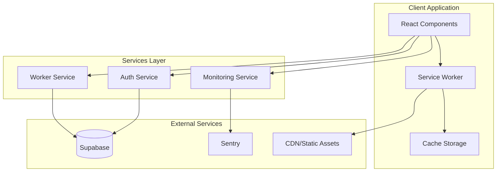

# Design Document: Infrastructure Enhancements

## Overview

This design document outlines the architecture and implementation approach for five major infrastructure enhancements to the Forge worker marketplace application:

1. **Database Integration** - Migrate from localStorage to Supabase for persistent, scalable data storage
2. **Automated Testing** - Establish Vitest-based testing infrastructure with property-based testing
3. **PWA/Service Worker** - Enable offline functionality and native app-like experience
4. **Monitoring Infrastructure** - Integrate Sentry for error tracking and performance monitoring
5. **CDN/Asset Optimization** - Configure Vite for optimal production builds

The current application uses localStorage for all data persistence, which limits scalability and cross-device access. These enhancements will transform it into a production-ready platform.

## Architecture



### Data Flow

1. **Authentication Flow**: User credentials → Auth Service → Supabase Auth → JWT Token → Client Session
2. **Data Flow**: UI Request → Service Layer → Supabase Client → PostgreSQL → Response with RLS enforcement
3. **Offline Flow**: Request → Service Worker → Cache Check → Cached Response OR Network Fetch → Cache Update
4. **Error Flow**: Error Thrown → Error Boundary → Sentry SDK → Sentry Dashboard

## Components and Interfaces

### 1. Supabase Client Module

```typescript
// services/supabase.ts
interface SupabaseConfig {
  url: string;
  anonKey: string;
}

interface SupabaseClientModule {
  client: SupabaseClient;
  initialize(): Promise<void>;
  getSession(): Promise<Session | null>;
}
```

### 2. Auth Service (Refactored)

```typescript
// services/authService.ts
interface AuthService {
  signUp(email: string, password: string, metadata: UserMetadata): Promise<AuthResponse>;
  signIn(email: string, password: string): Promise<AuthResponse>;
  signOut(): Promise<void>;
  getUser(): Promise<User | null>;
  onAuthStateChange(callback: (event: AuthChangeEvent, session: Session | null) => void): Subscription;
}

interface UserMetadata {
  phone: string;
  role: UserRole;
  country: 'GH' | 'NG';
  firstName?: string;
  lastName?: string;
}

interface AuthResponse {
  user: User | null;
  session: Session | null;
  error: AuthError | null;
}
```

### 3. Worker Service

```typescript
// services/workerService.ts
interface WorkerService {
  createProfile(userId: string, profile: WorkerProfileInput): Promise<WorkerProfile>;
  updateProfile(profileId: string, updates: Partial<WorkerProfileInput>): Promise<WorkerProfile>;
  getProfile(profileId: string): Promise<WorkerProfile | null>;
  searchProfiles(filters: WorkerSearchFilters): Promise<WorkerProfile[]>;
}

interface WorkerSearchFilters {
  location?: string;
  country?: 'GH' | 'NG';
  skills?: string[];
  minRating?: number;
  maxHourlyRate?: number;
}

interface WorkerProfileInput {
  name: string;
  role: string;
  location: string;
  country: 'GH' | 'NG';
  bio: string;
  hourlyRate: { min: number; max: number; currency: 'GHS' | 'NGN' };
  skills: string[];
  experienceYears?: number;
}
```

### 4. Service Worker Module

```typescript
// sw.ts (Service Worker)
interface CacheConfig {
  staticAssets: string[];
  apiRoutes: RegExp[];
  maxAge: number;
}

interface ServiceWorkerModule {
  precacheAssets(assets: string[]): Promise<void>;
  handleFetch(request: Request): Promise<Response>;
  notifyUpdate(): void;
}
```

### 5. Monitoring Service

```typescript
// services/monitoringService.ts
interface MonitoringService {
  initialize(config: SentryConfig): void;
  captureError(error: Error, context?: ErrorContext): void;
  captureMessage(message: string, level: SeverityLevel): void;
  startTransaction(name: string, op: string): Transaction;
  setUser(user: UserContext | null): void;
}

interface SentryConfig {
  dsn: string;
  environment: string;
  release?: string;
  tracesSampleRate: number;
}

interface ErrorContext {
  tags?: Record<string, string>;
  extra?: Record<string, unknown>;
}

interface UserContext {
  id: string;
  role?: string;
}
```

## Data Models

### Supabase Database Schema

```sql
-- Users table (extends Supabase Auth)
CREATE TABLE public.profiles (
  id UUID REFERENCES auth.users(id) PRIMARY KEY,
  phone TEXT NOT NULL,
  role TEXT NOT NULL CHECK (role IN ('worker', 'customer', 'admin')),
  first_name TEXT,
  last_name TEXT,
  avatar_url TEXT,
  profile_completed BOOLEAN DEFAULT FALSE,
  created_at TIMESTAMPTZ DEFAULT NOW(),
  updated_at TIMESTAMPTZ DEFAULT NOW()
);

-- Worker profiles table
CREATE TABLE public.worker_profiles (
  id UUID PRIMARY KEY DEFAULT gen_random_uuid(),
  user_id UUID REFERENCES public.profiles(id) NOT NULL,
  name TEXT NOT NULL,
  role TEXT NOT NULL,
  location TEXT NOT NULL,
  country TEXT NOT NULL CHECK (country IN ('GH', 'NG')),
  bio TEXT,
  hourly_rate_min NUMERIC,
  hourly_rate_max NUMERIC,
  currency TEXT CHECK (currency IN ('GHS', 'NGN')),
  rating NUMERIC DEFAULT 0,
  review_count INTEGER DEFAULT 0,
  skills TEXT[],
  tier TEXT DEFAULT 'free' CHECK (tier IN ('free', 'basic', 'premium')),
  verified BOOLEAN DEFAULT FALSE,
  experience_years INTEGER,
  created_at TIMESTAMPTZ DEFAULT NOW(),
  updated_at TIMESTAMPTZ DEFAULT NOW()
);

-- Reviews table
CREATE TABLE public.reviews (
  id UUID PRIMARY KEY DEFAULT gen_random_uuid(),
  worker_id UUID REFERENCES public.worker_profiles(id) NOT NULL,
  author_id UUID REFERENCES public.profiles(id) NOT NULL,
  rating INTEGER NOT NULL CHECK (rating >= 1 AND rating <= 5),
  text TEXT,
  created_at TIMESTAMPTZ DEFAULT NOW()
);

-- Row Level Security Policies
ALTER TABLE public.profiles ENABLE ROW LEVEL SECURITY;
ALTER TABLE public.worker_profiles ENABLE ROW LEVEL SECURITY;
ALTER TABLE public.reviews ENABLE ROW LEVEL SECURITY;

-- Profiles: Users can read all, update own
CREATE POLICY "Profiles are viewable by everyone" ON public.profiles FOR SELECT USING (true);
CREATE POLICY "Users can update own profile" ON public.profiles FOR UPDATE USING (auth.uid() = id);

-- Worker profiles: Public read, owner update
CREATE POLICY "Worker profiles are viewable by everyone" ON public.worker_profiles FOR SELECT USING (true);
CREATE POLICY "Workers can update own profile" ON public.worker_profiles FOR UPDATE USING (auth.uid() = user_id);
CREATE POLICY "Workers can insert own profile" ON public.worker_profiles FOR INSERT WITH CHECK (auth.uid() = user_id);

-- Reviews: Public read, authenticated insert
CREATE POLICY "Reviews are viewable by everyone" ON public.reviews FOR SELECT USING (true);
CREATE POLICY "Authenticated users can create reviews" ON public.reviews FOR INSERT WITH CHECK (auth.uid() = author_id);
```

### PWA Manifest

```json
{
  "name": "Forge - Worker Marketplace",
  "short_name": "Forge",
  "description": "Find skilled workers in Ghana and Nigeria",
  "start_url": "/",
  "display": "standalone",
  "background_color": "#ffffff",
  "theme_color": "#3b82f6",
  "icons": [
    { "src": "/icons/icon-192.png", "sizes": "192x192", "type": "image/png" },
    { "src": "/icons/icon-512.png", "sizes": "512x512", "type": "image/png" }
  ]
}
```

## Correctness Properties

*A property is a characteristic or behavior that should hold true across all valid executions of a system-essentially, a formal statement about what the system should do. Properties serve as the bridge between human-readable specifications and machine-verifiable correctness guarantees.*

Based on the prework analysis, the following correctness properties will be validated through property-based testing:

### Property 1: User Registration Round Trip
*For any* valid user registration data (email, password, metadata), after successful registration, querying the user profile should return data equivalent to the input metadata.
**Validates: Requirements 1.2**

### Property 2: Login Returns Valid Session
*For any* registered user with valid credentials, calling signIn should return a non-null session with a valid JWT token.
**Validates: Requirements 1.3**

### Property 3: Worker Profile Persistence Round Trip
*For any* valid worker profile input, after creating or updating a profile, querying that profile should return data equivalent to the input.
**Validates: Requirements 1.4**

### Property 4: Worker Search Filter Correctness
*For any* set of worker profiles and search filter criteria, all returned profiles should satisfy every specified filter condition (location matches, skills contain required skills, rating >= minRating).
**Validates: Requirements 1.5**

### Property 5: Database Error Structure
*For any* database operation that fails, the returned error object should contain a non-empty error code and a non-empty user-friendly message string.
**Validates: Requirements 1.6**

### Property 6: Row Level Security Enforcement
*For any* user querying worker profiles, the user should only be able to update profiles where they are the owner (user_id matches auth.uid()).
**Validates: Requirements 1.7**

### Property 7: Offline Cache Serving
*For any* URL that has been previously cached, requesting that URL while offline should return a response with status 200.
**Validates: Requirements 3.2**

### Property 8: Stale-While-Revalidate Strategy
*For any* cached API response, the cache strategy should return the cached response immediately (within 50ms) while initiating a background revalidation.
**Validates: Requirements 3.5**

### Property 9: Error Capture Completeness
*For any* error passed to captureError, the captured event should include the error message, stack trace, and timestamp.
**Validates: Requirements 4.2**

### Property 10: Performance Transaction Recording
*For any* transaction started with startTransaction, the transaction should record start time, end time, and operation name when finished.
**Validates: Requirements 4.3**

### Property 11: Error Context Attachment
*For any* error captured when a user is authenticated, the captured event should include the user's anonymized ID and role.
**Validates: Requirements 4.4**

### Property 12: Sensitive Data Filtering
*For any* error context containing strings matching password, token, or secret patterns, the captured event should have those values redacted or removed.
**Validates: Requirements 4.5**

### Property 13: Image Optimization Output
*For any* input image processed during build, the output file size should be less than or equal to the input file size.
**Validates: Requirements 5.3**

### Property 14: CSS Purge Effectiveness
*For any* CSS input with unused selectors, the purged output should have fewer bytes than the input.
**Validates: Requirements 5.5**

## Error Handling

### Database Errors

```typescript
interface DatabaseError {
  code: string;
  message: string;
  details?: string;
  hint?: string;
}

const ERROR_CODES = {
  CONNECTION_FAILED: 'DB_001',
  QUERY_FAILED: 'DB_002',
  CONSTRAINT_VIOLATION: 'DB_003',
  RLS_VIOLATION: 'DB_004',
  TIMEOUT: 'DB_005',
} as const;

function handleDatabaseError(error: PostgrestError): DatabaseError {
  // Map Supabase errors to user-friendly messages
  const errorMap: Record<string, { code: string; message: string }> = {
    '23505': { code: ERROR_CODES.CONSTRAINT_VIOLATION, message: 'This record already exists' },
    '42501': { code: ERROR_CODES.RLS_VIOLATION, message: 'You do not have permission to perform this action' },
    'PGRST301': { code: ERROR_CODES.TIMEOUT, message: 'Request timed out. Please try again' },
  };
  
  return errorMap[error.code] || { 
    code: ERROR_CODES.QUERY_FAILED, 
    message: 'An unexpected error occurred' 
  };
}
```

### Service Worker Errors

- Cache storage quota exceeded: Clear old caches, notify user
- Network timeout: Return cached response if available, show offline indicator
- Service worker registration failure: Log to Sentry, continue without SW

### Monitoring Error Boundaries

```typescript
// Wrap application in error boundary that reports to Sentry
class SentryErrorBoundary extends React.Component {
  componentDidCatch(error: Error, errorInfo: React.ErrorInfo) {
    monitoringService.captureError(error, {
      extra: { componentStack: errorInfo.componentStack }
    });
  }
}
```

## Testing Strategy

### Testing Framework

- **Unit/Integration Testing**: Vitest (Vite-native, Jest-compatible API)
- **Property-Based Testing**: fast-check (TypeScript-native PBT library)
- **Component Testing**: React Testing Library
- **Mocking**: MSW (Mock Service Worker) for API mocking

### Test Organization

```
├── src/
│   ├── services/
│   │   ├── authService.ts
│   │   ├── authService.test.ts        # Unit tests
│   │   └── authService.property.test.ts # Property tests
│   ├── utils/
│   │   ├── crypto.ts
│   │   └── crypto.test.ts
│   └── components/
│       ├── Button.tsx
│       └── Button.test.tsx
├── tests/
│   ├── setup.ts                       # Test setup and global mocks
│   └── mocks/
│       └── handlers.ts                # MSW handlers
```

### Property-Based Testing Approach

Each correctness property will be implemented as a property-based test using fast-check:

```typescript
// Example: Property 4 - Worker Search Filter Correctness
import { fc } from 'fast-check';

/**
 * Feature: infrastructure-enhancements, Property 4: Worker Search Filter Correctness
 * Validates: Requirements 1.5
 */
test('search results match all filter criteria', () => {
  fc.assert(
    fc.asyncProperty(
      workerProfileArbitrary,
      searchFiltersArbitrary,
      async (profiles, filters) => {
        const results = await workerService.searchProfiles(filters);
        return results.every(profile => matchesAllFilters(profile, filters));
      }
    ),
    { numRuns: 100 }
  );
});
```

### Unit Testing Requirements

- Test specific edge cases not covered by property tests
- Test error handling paths
- Test React component rendering and interactions
- Minimum 80% code coverage target

### Test Configuration

```typescript
// vitest.config.ts
export default defineConfig({
  test: {
    globals: true,
    environment: 'jsdom',
    setupFiles: ['./tests/setup.ts'],
    coverage: {
      provider: 'v8',
      reporter: ['text', 'html', 'lcov'],
      exclude: ['node_modules/', 'tests/']
    }
  }
});
```
