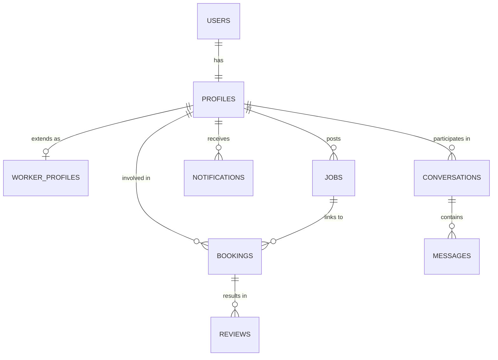
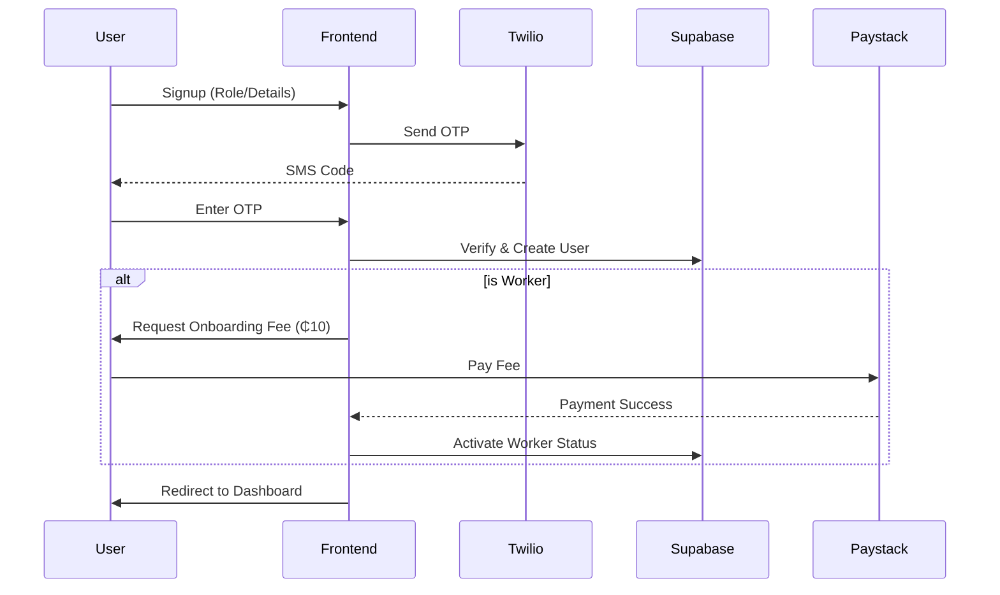
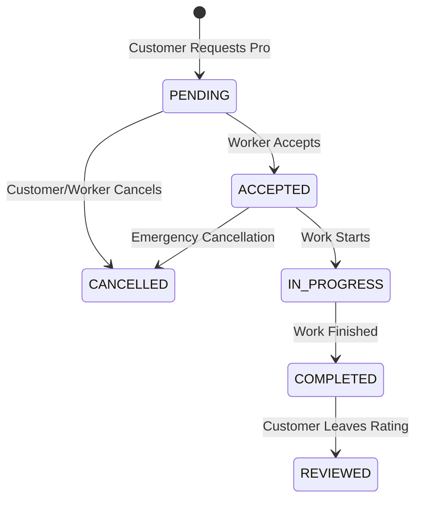

# FORGE Marketplace Documentation

## 1. Executive Summary
Forge is a localized, premium service marketplace platform designed for skilled professionals and customers in Ghana and Nigeria. It facilitates secure connections, service discovery, and project management for a wide range of trades, from electrical work and plumbing to event planning and fashion design.

---

## 2. System Architecture

Forge follows a modern, decoupled architecture:
- **Frontend**: React 19 + TypeScript + Vite + Tailwind CSS.
- **Backend-as-a-Service**: Supabase (Auth, PostgreSQL, Realtime, Storage).
- **AI Services**: Local (Ollama/Gemma 3) or Cloud (Gemini Flash).
- **Integrations**: Paystack (Payments), Twilio (SMS/OTP), Sentry (Monitoring).

### 2.1 Technology Stack
| Layer | Technology |
|-------|------------|
| UI Library | React 19 |
| Styling | Tailwind CSS |
| Icons | Lucide React |
| State Management | React Context API |
| Routing | React Router 7 |
| Database | PostgreSQL (Supabase) |
| Auth | Supabase Auth |
| Error Tracking | Sentry |

---

## 3. Data Model

The system uses a relational PostgreSQL schema designed for scalability and performance.



### 3.1 Key Tables
- **profiles**: Core user metadata (names, roles, location).
- **worker_profiles**: Specialized professional data (hourly rates, skills, tier).
- **jobs**: Customer-posted project opportunities.
- **bookings**: The lifecycle of a specific service engagement.
- **service_categories**: Dynamic, database-driven list of available trades.
- **transactions**: Financial records for subscriptions and fees.

---

## 4. Business Processes

### 4.1 Authentication & Onboarding Flow
Forge uses a secure, multi-step onboarding process to verify users and professional credentials.



### 4.2 Booking Lifecycle
The booking process manages the state transition from initial request to completion and review.



---

## 5. Security Model

### 5.1 Row Level Security (RLS)
Forge implements strict RLS policies on Supabase to ensure data privacy:
- **Profiles**: Publicly viewable for discovery; only editable by the owner.
- **Messages**: Only viewable by the sender or recipient.
- **Bookings**: Accessible only to the customer and worker involved.

### 5.2 Input Validation
- **Zod**: Used for robust frontend schema validation (passwords, forms).
- **PostgreSQL Constraints**: Enforced at the database level for data integrity.

---

## 6. AI Integration (The Forge Assistant)

Forge includes an intelligent assistant capable of:
1. **Local Reasoning**: Using Ollama (Gemma 3) for offline-capable task assistance.
2. **Cloud Reasoning**: Using Google Gemini for high-performance matching logic.
3. **Contextual Awareness**: The AI understands the user's role and location to provide relevant advice.

---

## 7. Operational Guidelines

### 7.1 Local Development
1. Install dependencies: `npm install`
2. Set up environment: Copy `.env.local.example` to `.env.local`
3. Run development server: `npm run dev`

### 7.2 Production Build
```bash
npm run build
```
This generates an optimized PWA (Progressive Web App) in the `dist/` folder, ready for hosting on Vercel, Netlify, or Supabase Hosting.

---

## 8. Support and Maintenance
- **Logging**: Powered by `utils/logger.ts`.
- **Monitoring**: Real-time error reporting via Sentry.
- **Performance**: Image optimization and lazy loading are enabled by default.
